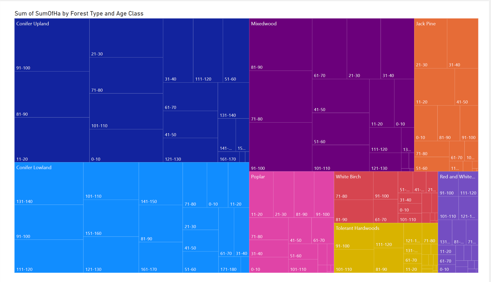

 
 
 The second visualization, done using Power BI, is a Tree Map that provides a hierarchical view of forest area distribution by Forest Type and Age Class in 2020. This visualization effectively breaks down the dataset into two levels of grouping:

 Categories (Forest Types):  Represented by the large rectangles, each forest type (e.g., Conifer Upland, Conifer Lowland, Mixedwood) is assigned a unique color for easy distinction.

 Details (Age Classes): Inside each forest type, smaller rectangles represent age classes (e.g., 0-10, 21-30), showing the distribution of forest areas within each category.

 Key Features of the Visualization :

 Hierarchy: The top-level grouping is Forest Type, representing large parent rectangles.
 Subcategories, Age Classes, are displayed as smaller rectangles within each forest type.

 Proportional Representation: The size of each rectangle is proportional to the Sum of SumOfHa (total forest area in hectares). Larger rectangles indicate higher contributions to the total forest area.

 Color Coding: Each forest type is uniquely color-coded (e.g., blue for Conifer Upland, purple for Mixedwood, etc.), making it visually intuitive.

 Data Labels: Each rectangle includes labels for Age Class and, in some cases, truncated labels for clarity.
 This provides detailed information directly on the visualization without needing to hover over elements.

What software did you use to create your data visualization?

 The second visualization was created using Power BI, a business intelligence tool known for its interactive and user-friendly features. Power BI was chosen for its ability to efficiently handle hierarchical data and create visually appealing tree maps.

Who is your intended audience?

 Environmental analysts and policymakers, Forestry management professionals, General public and stakeholders

What information or message are you trying to convey with your visualization?

 The distribution of forest areas by forest type and age class for the year 2020.
 Proportional contributions of each forest type and age class to the total forest area.
 The dominance of certain age classes within specific forest types.

What design principles (substantive, perceptual, aesthetic) did you consider when making your visualization? How did you apply these principles? With what elements of your plots?

 Substantive Principles: Focused on showing meaningful data by filtering to the year 2020 to avoid overwhelming the audience with unnecessary years.
 Grouped data hierarchically by forest type and age class to match analysis objectives.

 Perceptual Principles: Used color coding for forest types to make distinctions clear.
 Proportional sizing of rectangles ensured the audience could easily compare values.

 Aesthetic Principles: Chose a clean layout with clear labels for each forest type and age class.
 Limited the number of colors to maintain visual harmony and avoid clutter.

How did you ensure that your data visualizations are reproducible? If the tool you used to make your data visualization is not reproducible, how will this impact your data visualization?

 The Power BI visualization is not fully reproducible because its configurations, such as filtering the data for the year 2020, assigning fields to Category, Details, and Values, and formatting choices, are done manually and are not automatically documented.
 This lack of scripting or automation means the exact visualization cannot be recreated without the .pbix file and step-by-step documentation.
 This impacts the visualization by limiting transparency, making collaboration more challenging, and reducing its credibility for validation or further analysis. To mitigate this, the .pbix file and raw dataset must be shared along with detailed documentation of the steps taken, ensuring others can replicate or build upon the work.

How did you ensure that your data visualization is accessible?

 Color coding was chosen with high contrast to accommodate colorblind individuals. 

 Data labels and tooltips were included to provide detailed information without overwhelming the visualization.

Who are the individuals and communities who might be impacted by your visualization?

 Forestry management organizations: To plan reforestation and resource allocation efforts.

 Policymakers: To create regulations for sustainable forest management.

 Environmental researchers and activists: To study forest age distributions and advocate for conservation efforts.

 Local communities: Dependent on forests for livelihoods and natural resources.

How did you choose which features of your chosen dataset to include or exclude from your visualization?

 Only the year 2020 was included to focus on a single time point for simplicity and clarity. 
 Forest Type, Age Class, and SumOfHa were included as they directly align with the analysis goals. 
 Data from other years to avoid clutter and unnecessary complexity. 
 Other irrelevant columns that didn’t contribute to the hierarchical breakdown.

What ‘underwater labour’ contributed to your final data visualization product?

 Filtering the dataset to focus only on the year 2020.

 Aggregating the data by forest type and age class to match Power BI’s tree map structure.

 Testing and refining the visualization to ensure clarity and readability.

 Debugging issues with labels and color coding in Power BI.

 Ensuring the final tree map accurately represents the dataset and adheres to the intended design principles. 

